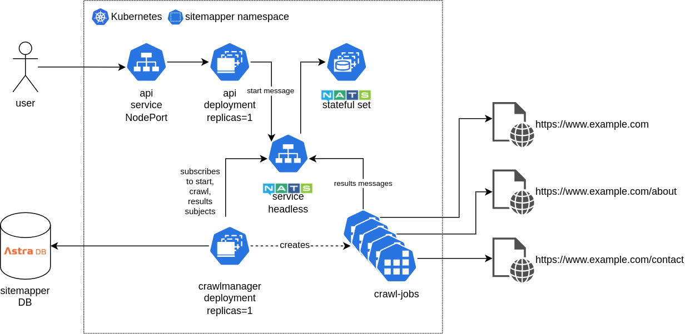

# SiteMapper (Kubernetes)

This SiteMapper project provides two implementations:

* A standalone SiteMapper CLI tool, run from a single executable binary ([link](./README.md))
* An job queue implementation which running on Kubernetes, using NATS pub/sub messaging and a managed Cassandra database (AstraDB)

This README details the Kubernetes implementation. For more information see my blog post [here](https://www.dinofizzotti.com/blog/2022-01-04-sitemapper-part-2-distributed-crawling-using-kubernetes-nats-and-cassandra/).

## Overview

_Note: The point of doing this was not to provide an optimal solution, but to experiment and play with Kubernetes, Go, NATS, Cassandra._

_Another Note: This is not a tutorial and I'm not "maintaining" this project. This repo is for me to store what I've been working on._

While the stand-alone CLI implementation uses Go concurrency primitives to run multiple concurrent crawl tasks for a given root URL, the Kubernetes implementation uses a long-lived "crawl manager" pod to create ephemeral [Kubernetes Job](https://kubernetes.io/docs/concepts/workloads/controllers/job/) pods to crawl a single URL. A Kubernetes job runs a pod until completion.



The crawl manager subscribes to three individual NATS subjects at start-up. Different activities are triggered by the messages received on each of the subjects:

* a "start" message begins the crawl activity for a root URL
* a "crawl" message instructs the crawl manager to create a Job pod for a specific URL
* a "results" message saves the results of a crawl and creates new crawl messages for each result

State for each sitemap, such as the root URL and the maximum crawl depth is saved to a managed Cassandra database using AstraDB.

The job pods call into the same SiteMapper Go code as per the stand-alone implementation, but only crawl a single URL (depth = 1). In place of writing the results to stdout, a message containing the URL and URL links results are published to the NATS results subject.

See below flow charts detailing how each type of message is handled by the crawl manager.

An "api" deployment exists which exposes a simple REST API for sitemap creation and result retrieval.

* POST /sitemap with JSON body
  * This creates a "start" NATS message
* GET /sitemap/\<sitemap-id\>

Sample requests and responses can be found below.

## Notes on Kubernetes Deployment

I'm using [Skaffold](https://skaffold.dev/) and [Helm](https://helm.sh/) for deployment to two different Kubernetes clusters:

* localhost cluster using [k3d](https://k3d.io/)
* Raspberry Pi cluster using [k3s](https://k3s.io/)
  * See my previous blog post on how I originally set this up [here](https://www.dinofizzotti.com/blog/2020-05-09-raspberry-pi-cluster-part-2-todo-api-running-on-kubernetes-with-k3s/)

My [skaffold.yaml](./skaffold.yaml) contains a profile for each of the clusters above. For the Pi cluster I use Docker's [buildx](https://docs.docker.com/buildx/working-with-buildx/) tool to build ARM images. I push the images to a local Docker registry instance I keep running in my home server.

Here is how I deploy to k3d:

```shell
skaffold run --default-repo 192.168.0.13:5577 --insecure-registry 192.168.0.13:5577 -p k3d
```

For the Pi cluster I just swap out the `-p k3d` param for `-p picluster`.

### Node labels

The pods will only run on a node labelled with `k3s-role: agent`.

## AstraDB

The AstraDB client ID, client secret and path to ZIP file are read from environment variables sourced from a Kubernetes [secret](https://kubernetes.io/docs/concepts/configuration/secret/):

```shell
kubectl create secret generic astra-auth \
  --from-literal=clientID='<client id>' \
  --from-literal=clientSecret='<client secret>' \
--from-literal=zipPath='/astra/secure-connect-sitemapper.zip'
```

## NATS

NATS is deployed to the Kubernetes cluster using a Helm chart:

```shell
$ helm repo add nats https://nats-io.github.io/k8s/helm/charts/
$ helm install nats nats/nats
 ```

## API

### Usage example

First retrieve the NODE_IP and NODE_PORT the sitemap:

```bash
export NODE_PORT=$(kubectl get --namespace sitemapper -o jsonpath="{.spec.ports[0].nodePort}" services sitemapper)
export NODE_IP=$(kubectl get nodes --namespace sitemapper -o jsonpath="{.items[0].status.addresses[0].address}")
```

Send a POST to /sitemap with the URL and MaxDepth parameters:

```bash
$ curl -s -X POST http://$NODE_IP:$NODE_PORT/sitemap -d '{"URL":"https://www.google.com","MaxDepth":2}' | jq
{
  "URL": "https://www.google.com",
  "MaxDepth": 2,
  "SitemapID": "918e9d19-6c91-11ec-8f5b-9269ffb7ee39"
}
```

Once the crawl jobs have all completed you can retrieve the results using the sitemap ID returned in the response above:

```bash
$ curl -s http://$NODE_IP:$NODE_PORT/sitemap/918e9d19-6c91-11ec-8f5b-9269ffb7ee39 | jq
{
  "SitemapID": "918e9d19-6c91-11ec-8f5b-9269ffb7ee39",
  "MaxDepth": 2,
  "URL": "https://www.google.com",
  "Results": [
    {
      "URL": "https://www.google.com",
      "Links": [
        "https://www.google.com/advanced_search",
        "https://www.google.com/intl/en/about.html",
        "https://www.google.com/intl/en/ads/",
        "https://www.google.com/intl/en/policies/privacy/",
        "https://www.google.com/intl/en/policies/terms/",
        "https://www.google.com/preferences",
        "https://www.google.com/services/",
        "https://www.google.com/setprefdomain"
      ]
    },
    {
      "URL": "https://www.google.com/advanced_search",
      "Links": [
        "https://www.google.com/chrome/",
        "https://www.google.com/finance",
        "https://www.google.com/preferences",
        "https://www.google.com/travel/",
        "https://www.google.com/url",
        "https://www.google.com/webhp"
      ]
    },
<----- results abridged ------>

```
