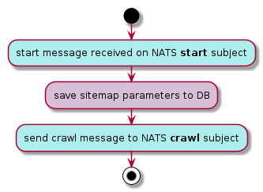
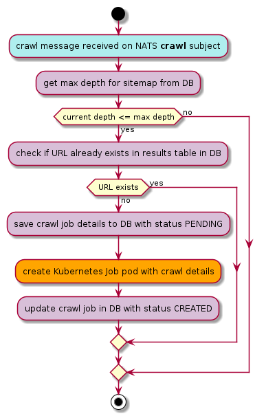
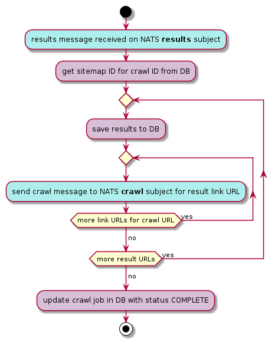

# sitemapper (Kubernetes)

This sitemapper project provides two implementations:

* A standalone sitemapper CLI tool, run from a single executable binary TODO: link
* An job queue implementation which running on Kubernetes, using NATS pub/sub messaging and a managed Cassandra database (AstraDB)

This README details the Kubernetes implementation.

## Overview

While the standalone CLI implementation uses Go concurrency primitives to run multiple concurrent crawl tasks for a given root URL, the Kubernetes implementation uses a long-lived "crawl manager" pod to create ephemeral Kubernetes Job pods to crawl a single URL.

The crawl manager activities are triggered by specific NATS messages:

* a "start" message begins the crawl activity for a root URL
* a "crawl" message instructs the crawl manager to create a Job pod for a specific URL
* a "results" message saves the results of a crawl and creates new crawl messages for each result

State for each sitemap, such as the root URL and the maximum crawl depth is saved to a managed Cassandra database using AstraDB TODO link.

The job pods call into the same sitemapper Go code as per the standalone implementation, but only crawl a single URL (depth = 1). In place of writing the results to stdout, a message containing the URL and URL links results are published to the NATS results subject.

See below flow charts detailing how each type of message is handled by the crawl manager.

#### NATS start message handling

Example start message:
```json
{
  "SitemapID": "1fb9370a-68b0-11ec-b17f-2fd91b6befcc",
  "URL": "https://dinofizzotti.com",
  "MaxDepth": 3
}
```



#### NATS crawl message handling

Example crawl message:
```json
{
  "CrawlID": "49d75b94-68b0-11ec-a451-4f47ed125bea",
  "SitemapID": "1fb9370a-68b0-11ec-b17f-2fd91b6befcc",
  "URL": "https://google.com",
  "CurrentDepth": 1
}
```



#### NATS results message handling

Example results message:
```json
{
  "CrawlID": "49d75b94-68b0-11ec-a451-4f47ed125bea",
  "Results": [
    {
      "URL": "https://google.com",
      "Links": [
        "https://accounts.google.com/ServiceLogin",
        "https://drive.google.com/",
        "https://mail.google.com/mail/",
        "https://news.google.com/",
        "https://play.google.com/",
        "https://www.google.com/advanced_search",
        "https://www.google.com/intl/en/about.html",
        "https://www.google.com/intl/en/ads/",
        "https://www.google.com/intl/en/policies/privacy/",
        "https://www.google.com/intl/en/policies/terms/",
        "https://www.google.com/preferences",
        "https://www.google.com/services/",
        "https://www.google.com/setprefdomain"
      ]
    }
  ]
}
```


## Pre-requisites

## k3d

## Skaffold

## Helm

## AstraDB

## Deploy

### NATS

### Secrets

### Sitemapper
